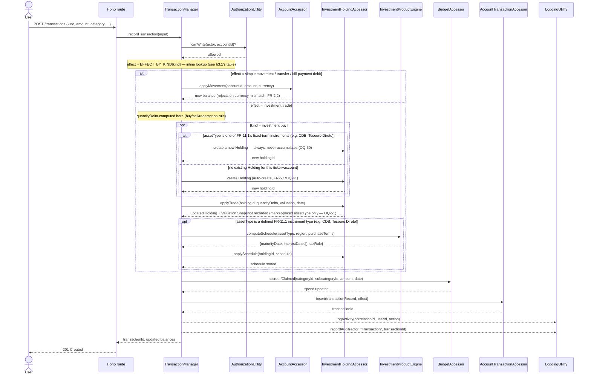

# Backend VBD Decomposition

Volatility-Based Decomposition of the New Finance App backend, derived
directly from `docs/requirements/01-core-use-cases.md` (CUC-1–CUC-10) and
`02-functional-requirements.md` (FR-1–FR-10). Nothing here re-derives
volatility from scratch — every component below traces to a volatility
note already written down during requirements.

Stack: Node.js + Hono + PostgreSQL + Drizzle ORM + Winston, TypeScript,
purely functional (no classes) — components are modules of pure/async
functions, not objects.

> **Revision history (condensed):**
> - **Round 1:** 18 Managers / 14 Engines → 6 Managers / 12 Engines.
>   Managers were one-per-entity (functional decomposition wearing VBD's
>   vocabulary); regrouped by trigger pattern. Removed `WidgetResolutionEngine`
>   and `NotificationTriggerEngine` (dispatch tables, no computation).
> - **Round 2:** `AccountManager` + `PlanningManager` merged (same trigger
>   pattern: occasional user-initiated setup) → **5 Managers**.
> - **Round 3:** Managers made **fractal** — a Manager must never hold a
>   direct reference to another Manager. Added `ServiceBusUtility`
>   (publish / request-reply) as the only Manager↔Manager channel.
> - **Round 4:** the entity-per-component mistake recurred at the Engine
>   tier. Removed `TransactionClassificationEngine` (a lookup, not
>   computation), `AccountBalanceEngine`, `CategoryTaxonomyEngine` (thin
>   validate-then-write) → **9 Engines**.
> - **Round 5:** `OpenBankingSyncManager` removed — "runs on a schedule" is
>   an execution-context detail, not a volatility axis → **4 Managers**.
> - **Round 6:** the same mistake recurred a second time at the Engine
>   tier, more broadly. `AccessControlEngine` is reclassified as a Utility
>   (the framework's own definition names "security" as a canonical
>   Utility concern). `PortfolioBuilderEngine` is removed (v1 portfolio
>   building is manual/UI-driven, per FR-5.5 — there's no backend
>   algorithm to isolate). `OpenBankingSyncEngine` is removed (payload
>   normalization is ordinary Resource Accessor work, not a separate
>   layer). `HoldingValuationEngine`, `BudgetTrackingEngine`,
>   `GoalProgressEngine`, `CreditCardBalanceEngine` are removed — each
>   was "decide what a transaction's side effect is" (a workflow decision,
>   which the framework's own Manager definition explicitly allows as
>   "high-level business logic") plus "write it with an invariant check"
>   (a validated write, which belongs on the Resource Accessor). **Now 1
>   Engine** (`ReportingEngine`, unifying the former `NetWorthEngine` +
>   `ReportingAggregationEngine` — both are "consume data, transform into a
>   report/graph/export shape," the same computation applied to different
>   outputs) **and 9 Utilities** (added `AccessControlUtility`).
> - **Round 7 (this revision) — driven by full use-case verification and
>   volatility reconciliation, not a fresh guess.** See
>   `docs/architecture/00-core-process-patterns.md`: enumerating and
>   diagramming 45 concrete use cases across 8 of the 10 CUCs surfaced 4
>   generic process patterns (Create, Edit, Lifecycle Transition, View)
>   that now supersede the CUC list as the primary decomposition input,
>   and a volatility-reconciliation pass cut the evidenced-volatility list
>   from 15 speculative entries to 7 real ones (removing false volatilities
>   like Owner-succession-as-volatile — it's an invariant, not a change
>   axis — and Budgeting-model-as-volatile — pure speculation with no
>   stakeholder signal). Concretely: **Engines go to 2** (added
>   `InvestmentProductEngine` for FR-11's instrument-specific
>   maturity/interest/tax rules — genuine computation Round 6 didn't have
>   a home for). **Resource Accessors: 17 active + 4 parked** (removed
>   `CurrencyReferenceRateAccessor` entirely — OQ-49 made currency
>   conversion frontend-only, never persisted; split `InvitationAccessor`
>   out of `HouseholdAccessor` — Invitation has its own lifecycle,
>   independent of Membership; extended `InvestmentHoldingAccessor` with
>   FR-11's schedule; parked `OpenBankingConnectionAccessor`,
>   `OpenFinanceBrasilAccessor`, `USOpenBankingAccessor`,
>   `MarketAnalysisProviderAccessor` alongside their deferred CUCs, not
>   dropped). **Utilities: 7, down from 9** — merged `ApplicationLogUtility`
>   + `AuditLogUtility` → `LoggingUtility` (same mechanism, parameterized
>   by which kind of entry); split what used to be lumped under "security"
>   into `AuthenticationUtility` (merged `PasswordHashUtility` +
>   `TOTPUtility` — pure identity-proof primitives, volatile because crypto
>   standards evolve externally) and `AuthorizationUtility` (renamed from
>   `AccessControlUtility` — volatile because *this app's* role/permission
>   model evolves, a genuinely different driver than crypto standards).
>   Considered and rejected: a `RolePermissionAccessor` for the
>   Role/permission matrix — Role isn't household-customizable data like
>   Category, it's a developer-versioned enum like Transaction Kind, so it
>   stays an in-code reference-data table `AuthorizationUtility` reads
>   inline, no new persisted component. **Managers stay at 4, unchanged in
>   count** — the process-pattern axis (what kind of operation) is
>   orthogonal to the trigger-pattern axis (why/when it fires) that already
>   grouped them, and explains *why* `InsightsManager` was already correct
>   to stand alone: Create/Edit/Lifecycle-Transition are inherently
>   owned-entity operations, View is inherently cross-entity. **§3
>   (Communication Rules) through §6 (Validation) below are STALE as of
>   this revision** — they still reference pre-Round-7 names
>   (`AccessControlUtility`, `PasswordHashUtility`, `TOTPUtility`,
>   `ApplicationLogUtility`, `AuditLogUtility`, `CurrencyReferenceRateAccessor`)
>   and have not yet been reworked against the Round 7 component list; that
>   rework is the next design conversation, not done yet.
> - **Round 8 — closing three cascades the data-modeling
>   pass (`docs/architecture/02-data-model.md`) surfaced, not a fresh
>   design pass of its own.** FR-4.4's budget-alert threshold is removed
>   (OQ-52, judged too noisy) — `BudgetAccessor.accrueIfClaimed` no longer
>   reports a threshold-crossed signal, `TransactionManager`'s pipeline no
>   longer fires `NotificationDeliveryUtility` on it, and that Utility is
>   now unwired in the component diagram (its only other trigger, Open
>   Banking sync failure, is itself parked). §3.1's investment-buy
>   sub-steps and §5's sequence diagram now branch on `assetType` for
>   OQ-50 (a fixed-term instrument purchase always creates a new Holding,
>   never accumulates) and OQ-51 (`ReportingEngine` reads a fixed-term
>   Holding's `cost_basis` directly instead of `ValuationSnapshotAccessor`,
>   which a fixed-term Holding never populates — new edge,
>   `ReportingEngine` → `InvestmentHoldingAccessor`). `EFFECT_BY_KIND` is
>   enumerated explicitly for the first time (§3.1), rather than left as
>   "inline reference-data lookup." **Resource Accessors: 18 active, up
>   from 17** — added `RecurringTransactionScheduleAccessor`, and a new
>   §3.2b walks through the recurring-transaction scheduled trigger as its
>   own flow (a fourth entry point into §3.1's pipeline, the same
>   shape as §3.2/§3.2a), which existed at the requirements level (FR-3.5/
>   OQ-38) but had never been traced through this document before.
> - **Round 9 (this revision, Oct 2026) — the design round's decisions
>   carried into the backend, via the call chain and Manager reviews**
>   (`docs/architecture/06-call-chain-review-2026-10.md`,
>   `07-manager-review-2026-10.md`). "Objective" is renamed "Goal"
>   throughout (OQ-66). **Managers 4, Engines 2, Utilities 7 — unchanged.
>   Resource Accessors: 16 active + 6 parked** (count corrected during PD, Oct 2026 — earlier rounds said 18) — `RecurringTransactionScheduleAccessor`
>   removed with FR-3.5 (OQ-55) and §3.2b's trigger with it; **new
>   `IndexRateAccessor`** (FR-11.6, OQ-59); `DashboardAccessor` **parked
>   until v3** (OQ-67). `ValuationSnapshotAccessor`'s manual snapshots
>   become editable/deletable (OQ-56). `InvestmentProductEngine` gains
>   `project(holding)` — expected payout + taxes from coded per-type tax
>   rules and the latest index rate — and a second caller,
>   `InsightsManager` (OQ-58/79). `ReportingEngine` gains payout series,
>   month overview and net-worth change (FR-5.9, 6.11, 5.3). Holdings
>   auto-archive at zero quantity and auto-unarchive (OQ-72/80). New
>   **read-ownership rule** (§3, Manager review M1); Browse & Filter
>   Transactions owned by `TransactionManager` (stakeholder decision);
>   `AccountManager` subscribes to `holding.matured`; the two daily
>   investment jobs merge into one `investmentsDaily` trigger (§3.2a);
>   stale `SessionAccessor` entry removed from `InsightsManager` (M2).
>   §2.1 documents when `AccountManager` should be spun out into its own
>   subsystem (M3/Q2).

## 1. Core Use Cases (input) — superseded by process patterns as of Round 7

The 10 CUCs below are still the domain-scoping input (*what data* the
system manages) but are **no longer the primary input for this document's
component boundaries** — that's now
`docs/architecture/00-core-process-patterns.md`'s 4 generic process
patterns (Create, Edit, Lifecycle Transition, View), derived by diagramming
all 45 concrete use cases across these CUCs and comparing their shapes.
Read that document first; this table is kept for domain traceability.

| CUC | Name | Status |
|---|---|---|
| CUC-1 | Manage Household & Membership | Use cases isolated (20) |
| CUC-2 | Authenticate Securely | Use cases isolated (part of the 20 above) |
| CUC-3 | Manage Financial Accounts (+ Credit Cards) | 3 of 6 isolated; Open Banking trio deferred |
| CUC-4 | Record Transactions (Account + Card ledgers, unified entry point, OQ-39) | 3 of 4 isolated; Open Banking auto-import deferred |
| CUC-5 | Budget Spending (Categories/Subcategories) | Isolated (3) |
| CUC-6 | Track Investments & Net Worth | Isolated (4); surfaced FR-11 (instrument product rules) |
| CUC-7 | Build FII / Stock Portfolios | Deferred whole, stakeholder's own call |
| CUC-8 | View Insights & Reports (Dashboard/Widgets) | Isolated (6) |
| CUC-9 | Audit & Review Activity | Isolated (1) |
| CUC-10 | Define & Track Investment Goals | Isolated (5) |

The evidenced volatility list (7 entries, reconciled against 15
speculative candidates) also lives in
`docs/architecture/00-core-process-patterns.md`'s companion analysis, not
duplicated here.

## 2. Component Inventory

### 2.1 Managers (orchestration + high-level business logic — "what")

Four, grouped by **trigger pattern**, unchanged since round 5 and
confirmed correct on review — and now, as of Round 7, understood more
precisely: each of the first three executes **Create/Edit/Lifecycle
Transition** (see `00-core-process-patterns.md`) against its own owned
entities, driven by per-entity-type configuration (validations,
invariants, cascades) rather than bespoke logic per use case.
`InsightsManager` executes **View** (render or export) across every
entity, which is why it was always the one Manager that doesn't fit the
"owns its entities" mold — View is inherently cross-entity, the other
three patterns aren't:

| Manager | Trigger pattern | Covers (CUC/FR) |
|---|---|---|
| `IdentityManager` | User establishes or exercises who-they-are | Auth, MFA, sessions, household creation/membership/roles (CUC-1, CUC-2, FR-1) |
| `AccountManager` | User sets something up — or maintains something — ahead of any actual cash-flow event | Financial Accounts (4 types, OQ-76), Credit Cards, Open Banking connection setup (parked, v2), Categories (icon/colour), Budgets, Goals (create/edit/complete/reopen/delete), **investment administration** — Holding goal allocations, **manual market values** (Valuation Snapshots: record/edit/delete, OQ-56), **Index Rates** (FR-11.6), archiving a matured Holding from its notification, and the `holding.matured` subscription that sends that notification; never invokes `InvestmentProductEngine`; no Holding creation path (OQ-53); Portfolio Builder (parked, v2) (CUC-3 config side, CUC-5, CUC-6 admin side, CUC-7, CUC-10, FR-2/4/5/8/10/11.6) |
| `TransactionManager` | A cash-flow event just happened — and the ledger those events form | All transaction orchestration — Account Transactions and Card Transactions, across every asset type, incl. Holding auto-archive/unarchive (OQ-72/80) — see §3.1; plus **Browse & Filter Transactions** (FR-3.12), a plain read of the ledger it owns (§3 read-ownership rule) (CUC-4, FR-3) |
| `InsightsManager` | User wants to see the state of things, aggregated or reshaped | Dashboard (fixed in v1; widgets v3), Month Overview, View Investments, View Goals, notification inbox (list, mark seen, delete), audit-log export; ad-hoc reports + CSV export (v2) (CUC-8, CUC-9, FR-6/7) |

The stakeholder's own framing of these four: `IdentityManager` captures
authentication and access together (one concern: who is this and what can
they do); `AccountManager` captures the content that governs the system
(the containers and rules everything else operates against);
`TransactionManager` captures the single highest-volatility use case —
processing a transaction, which branches into numerous side effects;
`InsightsManager` captures analysis of the data everything else produces.

**Round 9 — when to spin `AccountManager` out (Manager review, M3/Q2).**
It is now the largest Manager, but every responsibility still shares its
trigger pattern, and VBD splits by volatility, not size, so it stays one
Manager. Because Managers are fractal (§3.0) — they only meet through
`ServiceBusUtility` and shared Accessors — it can later become its own
subsystem with internal Managers without anything outside noticing. Do
that when **any** of these appears: (1) one part starts changing for a
different reason than the rest; (2) a part needs to deploy or scale
independently; (3) a part gets its own owner/team. Natural seams:
**containers** (accounts, cards), **planning** (categories, budgets,
goals), **investment administration** (allocations, market values, index
rates, matured holdings).

### 2.2 Engines (heavy computation/transformation — "how")

**Two, up from one as of Round 7.** The framework's own line between
Manager and Engine is sharper than "which feature is this for": a Manager
is allowed "high-level business logic" (deciding *what* should happen —
an enumerable, mostly linear set of workflow rules); an Engine is for
*heavy* computation, transformation, or complex business processes. Almost
everything previously classified as an Engine in this document was
actually the former, dressed as the latter — but FR-11 (surfaced during
use-case verification, not present when Round 6 last checked this tier)
clears the bar.

| Engine | Owns | Reads (Accessors) | Justifying note |
|---|---|---|---|
| `ReportingEngine` | Transforms raw ledger/holding data into every read-side output shape: net worth (current + by-month, per currency), Goal progress (current + by-month — returns each Holding's contribution in its own native currency, per OQ-49; cross-currency blending is now a frontend concern, not this Engine's), Budget status (actual vs. target), spend-by-category/subcategory, income-vs-expense (excluding transfers via the persisted `effect` column, FR-3.6), account-balance-by-month, and export formatting (CSV — v2, OQ-71 — PDF later). **Round 9:** payout this month + 12-month payout series per Holding (dividend/interest Account Transactions linked to the Holding — the only payout source, FR-5.9), month overview (inflow/outflow/net per currency + 12-month strip, excluding own-account transfers and bill payments via `effect`, FR-6.11), net-worth change vs previous month (FR-5.3). **Round 8/OQ-51:** a Holding's contribution to net worth/Goal progress branches on `assetType` — market-priced Holdings (stock/FII/fund/other) read `ValuationSnapshotAccessor`'s latest snapshot as before; a fixed-term instrument (FR-11.1) has none to read, so its contribution is simply `InvestmentHoldingAccessor`'s `cost_basis` column instead | `AccountAccessor`, `ValuationSnapshotAccessor`, `InvestmentHoldingAccessor` *(new, Round 8 — reads `cost_basis` for fixed-term Holdings, OQ-51)*, `AccountTransactionAccessor`, `CardTransactionAccessor`, `BudgetAccessor`, `GoalAccessor` | The same underlying data gets reshaped into genuinely different output forms for different consumers — that repeated *transformation* is what makes this real computation, not a validated write |
| `InvestmentProductEngine` *(new, Round 7; extended Round 9)* | **Round 9:** v1 list is now Brazil — CDB, LC, LF, LCI, LCA, CRA, CRI, Debenture (`incentivised` flag), Tesouro Direto; US — CD, Treasury (OQ-79); **tax rules are coded per type inside this Engine** (regressive IR / exempt; US = "not estimated"); new **`project(holding)`** returns expected payout + expected taxes, using the latest index value from `IndexRateAccessor` for index-linked rates — called by `InsightsManager` (View Investments), the Engine's second caller. Original scope: given an instrument type plus purchase terms, computes the interest-payment schedule (where applicable) and tax owed at each cash event (FR-11.2). Called by **`TransactionManager`**, inline within the investment-buy Record Transaction pipeline (§3.1) — the purchase terms it needs (`date`, `amount`, `dueDate`, `rate`) come from that transaction itself; `dueDate` and `rate` are user-supplied, never derived from `assetType`, since a CDB/LCI/LCA's specific term and rate are negotiated per contract. The resulting schedule is persisted via `InvestmentHoldingAccessor.applySchedule(...)`. **Not** called by `AccountManager`'s Edit Holding flow (valuation updates, Goal allocations) — that only ever validated-writes what the user submits directly. There's no Add Holding flow anymore (OQ-53), so nothing outside `TransactionManager`'s own pipeline ever needs this Engine. The later scheduled trigger that posts a due cash event reads the already-computed schedule off the Accessor and does **not** call this Engine again either — same shape as Open Banking sync reading pre-normalized data (§3.2) | `InvestmentHoldingAccessor` (write, via `TransactionManager`'s call), `IndexRateAccessor` (read, Round 9 — for `project`) | Genuinely instrument- and region-specific computation — a Brazilian CDB's tax rule shares nothing with a US Treasury bond's — this is exactly the "workflow decision + validated write" test *failing* to explain it away, unlike everything Round 6 removed |

**Removed across all rounds, and why — the two shapes that were never
real Engines, no matter which entity or feature they were attached to:**
- **Dispatch table, no computation:** `WidgetResolutionEngine`,
  `NotificationTriggerEngine`, `TransactionClassificationEngine` — each
  was "map value A to value B via a small table." That's reference data a
  Manager reads inline, not computation.
- **Workflow decision + validated write, no computation:**
  `AccountBalanceEngine`, `CategoryTaxonomyEngine`, `CreditCardBalanceEngine`,
  `HoldingValuationEngine`, `BudgetTrackingEngine`, `GoalProgressEngine`
  — each was "decide what a transaction/action implies (a Manager's
  high-level business logic), then persist it with an invariant check (a
  validated write on the Resource Accessor)." Neither half is Engine work.
- **Cross-cutting policy, not computation:** `AccessControlEngine` —
  the framework's own definition of Utility explicitly names "security" as
  a canonical example, same category as logging/auditing/pub-sub. It was
  never a computation problem; it's a yes/no gate.
- **No backend work exists yet to isolate:** `PortfolioBuilderEngine` — v1
  portfolio building is a manual, UI-driven workflow (FR-5.5); the backend
  just stores the resulting target list. An Engine here would have been
  designing for the *future* analysis-API phase (FR-5.7) before it exists.
- **Ordinary Resource Accessor responsibility:** `OpenBankingSyncEngine` —
  translating an external system's payload into our canonical shape is
  what any Resource Accessor already does for any external system (a
  payment gateway Accessor does the same). Promoting it to a separate
  layer duplicated the Accessor's own job.

### 2.3 Resource Accessors (environmental — "where," now also "validated write")

**16 active + 6 parked, as of Round 9** (corrected during project design — earlier text said 18 + 5, but the table below has 22 rows: the 16 built in v1, plus `PortfolioAccessor`, `DashboardAccessor` and the four external providers parked. Round 9
removes `RecurringTransactionScheduleAccessor` with FR-3.5, adds
`IndexRateAccessor`, and parks `DashboardAccessor` until v3). Still deliberately
**not** consolidated — this is the one tier where "many, one per
resource" is correct, not a smell. Several carry an explicit **validated
write** responsibility: the Manager decides *that* something should
happen and *what* the parameters are; the Accessor executes it, enforcing
whatever invariant belongs at the point of persistence (often literally a
database constraint).

| Accessor | Backs | Validated-write / invariant |
|---|---|---|
| `UserAccessor` | Users, credentials (incl. password hash, MFA secret, recovery codes, password-reset tokens) | Single-use recovery codes and reset tokens are consumed atomically (`consumeRecoveryCode`, `consumeResetToken`, OQ-103); duplicate email (case-insensitive) is a typed result |
| `SessionAccessor` | Refresh tokens per device/login — *not* raw JWTs, which are stateless (OQ-30) | Revoking = invalidating the refresh token record; the JWT itself simply expires shortly after. **Round 9:** `deleteAllExceptCurrent(userId, currentSessionId)` for "sign out all others" (FR-1.3) |
| `HouseholdAccessor` | Households, Memberships, roles | `transitionMembership(...)` (remove/leave, enforces "exactly one Owner," FR-1.18) rejects removing the Owner (FR-1.11/OQ-27); `transferOwnership(...)` is the atomic dual-role swap (FR-1.20/OQ-28) — never observably zero or two Owners |
| `InvitationAccessor` *(split out, Round 7)* | Invitations — own lifecycle (pending → accepted/declined/revoked), independent of Membership, which only exists post-acceptance | Create-time: rejects a target with no matching existing user (FR-1.19/OQ-26); transition methods back accept/decline/revoke |
| `AccountAccessor` | Financial Accounts | `applyMovement(accountId, amount, currency)` rejects a currency mismatch (FR-2.2) before applying the signed delta |
| `CreditCardAccessor` | Credit Cards (incl. outstanding balance) | `applyChargeOrRefund` / `applyBillPayment` resolve which billing cycle a transaction falls in (closing-date boundary, FR-2.8) and update the right total — `TransactionManager` decides *that* a charge happened, this Accessor decides *which cycle bucket* |
| `AccountTransactionAccessor` | Account Transaction ledger, including the persisted `effect` column (§3.1's reasoning — corrected cross-reference, Round 8; `EFFECT_BY_KIND` is now enumerated there explicitly) | — |
| `CardTransactionAccessor` | Card Transaction ledger — stays a separate ledger from Account Transactions (OQ-16) even though both are now reached through one unified entry point (OQ-39) | — |
| ~~`RecurringTransactionScheduleAccessor`~~ | **Removed, Round 9** — recurring transactions dropped (FR-3.5, OQ-55) | — |
| `CategoryAccessor` | Categories, Subcategories | Enforces exactly-two-levels and cascades an archive to Subcategories (FR-10.2/10.4) as part of the write; `seedDefaults(householdId)` creates the predefined default set (FR-10.1), called from `AccountManager`'s subscription to `household.created` (§3.1b), not from a direct `IdentityManager` call |
| `BudgetAccessor` | Budgets, Budget Periods | `assignTarget(...)` rejects a Category/Subcategory already claimed elsewhere in scope/period (FR-4.7 — a uniqueness constraint, not application logic); `accrueIfClaimed(categoryId, subcategoryId, amount, date)` resolves the rollup match (FR-4.6) and updates the Budget Period's spend — **Round 8: no longer returns a threshold-crossed signal**, since FR-4.4's alert threshold was removed (OQ-52); deletion (FR-4.10) is a hard delete releasing claimed targets — no archive, since Budget Periods are their own independent immutable record |
| `InvestmentHoldingAccessor` | Investment Holdings | `applyTrade(holdingId, quantityDelta, valuation, date)` — `TransactionManager` computes `quantityDelta` (positive for buy, negative for sell, `-currentQuantity` for redemption — its own workflow rule, FR-3.8) and this Accessor executes the write. **New, Round 7:** `applySchedule(holdingId, schedule)` persists `InvestmentProductEngine`'s FR-11 output; archiving is one-way (FR-5.8/OQ-43), not a hard delete, since Valuation Snapshot history and Goal allocations depend on the Holding existing. **Round 9:** `archive(holdingId, by)` records who archived (`system` at zero quantity via `applyTrade`, or `user` from the matured notification); `unarchiveIfSystemArchived(holdingId)` (OQ-80 — only system archives are undone); `findMaturedWithPosition(today)` + `markMaturedNotified(holdingId)` for the daily trigger (§3.2a) |
| `ValuationSnapshotAccessor` | Valuation Snapshots | Two kinds, tagged by `source`: **automatic** (written by `TransactionManager` with each buy/sell/redemption; changes only through its transaction) and **manual** market values (`AccountManager`: `insertManual` / `updateManual` / `deleteManual` — Round 9, OQ-56; the "never overwrite" rule is gone, update/delete refuse automatic rows). Fixed-term Holdings have none (OQ-51) |
| `GoalAccessor` | Goals, Goal Allocations | `allocate(holdingId, goalId, percentage)` rejects an allocation that would push the Holding's total past 100% (FR-8.3) — note allocation is written *from the Holding's edit flow*, not the Goal's (OQ-48); complete/reopen (FR-8.8/8.9, renamed from archive/unarchive — OQ-78) is the one reversible lifecycle transition in the whole system, distinct from delete (FR-8.6, hard, no history); written by two Managers (`AccountManager` on Edit Holding, `TransactionManager` on a bundled buy) — the ≤ 100% invariant lives here, so both paths get it |
| `IndexRateAccessor` *(new, Round 9)* | Household Index Reference Rates — dated history per index (Selic, CDI, IPCA, IGP-M; reference data, can grow) (FR-11.6, OQ-59) | Written by `AccountManager` (insert / update / delete); `latest(index)` read by `InvestmentProductEngine.project`; no automated feed in v1 |
| `PortfolioAccessor` | A user's composed Portfolio Target list (FII/stock + target %, FR-5.5/5.6) — **parked, CUC-7 deferred whole** | Plain CRUD — the "builder" is a UI workflow (stakeholder's framing), not backend logic |
| `DashboardAccessor` *(parked, v3 — OQ-67)* | Per-user Dashboard/Widget configuration — the v1 Dashboard is fixed and stores nothing | — |
| `AuditLogAccessor` | Audit Log entries — `{actor ID, timestamp, action, entity type, entity ID}` only, no before/after values or other PII (FR-7.1, revised for GDPR/LGPD compatibility, OQ-25) | Append-only (NFR-AUD-1); exported as CSV over a date range (FR-7.2/OQ-46), no in-app browsable table |
| `NotificationInboxAccessor` | In-app notification inbox (v1's only channel) | Seen/unseen state, set on read (FR-6.10/OQ-45); deletion is a hard delete, no archive |
| ~~`CurrencyReferenceRateAccessor`~~ | **Removed, Round 7.** Currency Reference Rates turned out to be frontend-only, on-the-fly, never persisted (OQ-49) — no backend Accessor ever needed to exist for this | — |
| `OpenBankingConnectionAccessor` *(parked)* | Account↔provider link + encrypted tokens — CUC-3/CUC-4 Open Banking trio deferred | — |
| `OpenFinanceBrasilAccessor` *(parked)* | External: Open Finance Brasil API (BRL accounts) | `fetchTransactionsSince(connection, since)` returns **already-canonical-shaped** transactions — normalization is this Accessor's own job, not a separate Engine's |
| `USOpenBankingAccessor` *(parked)* | External: US-oriented Open Banking provider (USD accounts) | Same contract as above |
| `MarketAnalysisProviderAccessor` *(parked)* | External: FII/stock analysis API — **unimplemented stub**, nothing currently calls it (FR-5.7, future phase) | — |

`OpenFinanceBrasilAccessor` and `USOpenBankingAccessor` implement one
common port (`fetchTransactionsSince`) so nothing above them needs to know
which region it's talking to — the direct structural answer to CUC-3's
"multi-region... behind one interface" requirement, now carried entirely
by the Accessor tier instead of split across an Accessor-plus-Engine pair.
(Parked, not deleted — the interface design stands, un-deferring the CUC
just means implementing it.)

**Considered and rejected, Round 7: `RolePermissionAccessor`.** The
Role/permission-matrix volatility found during reconciliation (CUC-1's
own example — "a role that can spend but not see net worth" — implies a
5th role is plausible, yet FR-1.6/1.7 hardcode exactly four roles as
prose) looked at first like it needed the same treatment as Category —
a database-backed Accessor households read/write. It doesn't: nothing in
the requirements says a *household* can define its own custom role: the
signal is that the *product* might add a new built-in role in a future
release. That's Transaction Kind's shape (`EFFECT_BY_KIND`, an in-code
reference table, no Accessor) not Category's (FR-10.1, explicitly
household-customizable, genuinely needs `CategoryAccessor`). The
permission matrix stays an in-code table `AuthorizationUtility` reads
inline.

### 2.4 Utilities (cross-cutting, domain-agnostic)

**Seven, down from nine, as of Round 7.** Two consolidations, both driven
by "same underlying mechanism, different volatility only in
configuration" — the same principle behind Transaction Kind and Widget
Type being data, not separate code paths, now applied one tier up.

| Utility | Capability |
|---|---|
| `LoggingUtility` *(merged, Round 7 — was `ApplicationLogUtility` + `AuditLogUtility`)* | One mechanism (append a structured record of what happened), two schema-enforced entry points so they can't blur into each other: `logActivity(...)` — rich context, correlation ID, acting-user tagging (NFR-OBS-1–3), wraps Winston directly — and `recordAudit(...)` — locked to `{actor, timestamp, action, entityType, entityId}` only, no before/after or other PII (FR-7.1, GDPR/LGPD-driven, OQ-25), persists via `AuditLogAccessor` |
| `AuthenticationUtility` *(merged, Round 7 — was `PasswordHashUtility` + `TOTPUtility`)* | Pure identity-proof primitives: password hash/verify (Argon2/bcrypt, NFR-SEC-4), MFA code generation/verification and recovery-code issuance (TOTP is the first supported method, not the only one — NFR-SEC-1's "at minimum" is the evidenced volatility this Utility exists to isolate). **Implemented (U4, OQ-100):** Argon2id; TOTP secrets encrypted at rest (AES-256-GCM); recovery codes and opaque tokens (refresh, password reset) issued here and stored only as hashes; 15-minute JWT access tokens. **Touches no storage**: callers persist what it returns (uc-14/uc-20 corrected accordingly) |
| `AuthorizationUtility` *(renamed, Round 7 — was `AccessControlUtility`)* | Role → permitted-action check; personal-vs-shared visibility (FR-1.7, 2.3, 4.2, 8.1). Called by all four Managers before proceeding — a yes/no gate, not a computation. Reads `HouseholdAccessor` and an in-code role/permission reference table (not `RolePermissionAccessor` — see §2.3's "considered and rejected" note). Volatile because *this app's* role model evolves — a different driver than `AuthenticationUtility`'s crypto-standard volatility, which is why these two stayed split rather than merging into one "security" Utility |
| `ServiceBusUtility` | Publish/subscribe messaging — the only channel Managers use to talk to each other (§3.0). In-process event emitter for v1; swappable later without any Manager's code changing. **Implemented (U6, OQ-102):** typed topic → payload map, messages carry the correlation ID, fire-and-forget delivery with failures isolated from the publisher, at-most-once (in memory) |
| `NotificationDeliveryUtility` | Delivers a notification — **type + parameters, never text (OQ-82)** — via a channel — **channels live inside this Utility** (OQ-84): in-app writes through `NotificationInboxAccessor`; **email is v1 for transactional auth email only** (password reset, FR-1.13), templated from the shared i18n catalog in the user's language; the email/push **provider is configuration** of this Utility (like `LoggingUtility`'s transports), not a separate Accessor — FR-6.5/OQ-5 — called directly by whichever Manager's workflow determined a notification is warranted (Round 9: `IdentityManager` for invitations, `AccountManager` for matured holdings). The frontend localizes (NFR-I18N-3). **Becomes a `NotificationEngine`** if per-user channel preferences, digests, quiet hours/throttling, or server-side text composition appear |
| `ValidationUtility` | Generic, domain-agnostic checks (currency-code format, positive-number, date-range sanity) |
| `CorrelationIdUtility` | Generates/propagates the request correlation ID used throughout NFR-OBS-1, including across `ServiceBusUtility` messages |

## 3. Communication Rules

**General rules (apply everywhere, no exceptions):**

| Source → Target | Permitted? | Rationale |
|---|---|---|
| Manager → Manager | **Never directly** — only via `ServiceBusUtility` | The fractal seam (§3.0) |
| Manager → Engine | Yes | `ReportingEngine` is called only by `InsightsManager` in practice; `InvestmentProductEngine` only by `TransactionManager` (§2.2) — but any Manager could call any Engine |
| Manager → Resource Accessor | Yes, including validated writes | This is now the primary way a Manager's workflow decision gets executed (§2.3) |
| Manager → Utility | Yes | Utilities are open to everyone, including `AuthorizationUtility` and `ServiceBusUtility` |
| Engine → Resource Accessor | Yes | How `ReportingEngine` reads its data, and how `InvestmentProductEngine`'s caller persists its output via `InvestmentHoldingAccessor.applySchedule(...)` |
| Engine → Engine | **Never** | Two Engines now (§2.2) — rule is no longer moot, still holds |
| Resource Accessor → anything | **Never upward** | Accessors are leaves |
| Utility → Resource Accessor | Yes, only for the Utility's own concern | e.g. `LoggingUtility` → `AuditLogAccessor`, `AuthorizationUtility` → `HouseholdAccessor` |
| Utility → Engine | **Never** | Would smuggle domain logic into a Utility |

**Read-ownership rule (Round 9, Manager review M1).** Every View use
case is placed by one test: *a plain list or filter of a Manager's own
entities is served by that Manager directly through its Accessors;
anything aggregated, combined across entities, or reshaped goes through
`InsightsManager` and `ReportingEngine`.* Examples — plain: View
Sessions, List My Households (`IdentityManager`), Browse & Filter
Transactions (`TransactionManager`), the notification inbox
(`InsightsManager`, which owns it). Reshaped: Dashboard, Month Overview,
View Investments, View Goals (`InsightsManager`).

### 3.0 Fractal Managers: why pub/sub is the only cross-Manager channel

Unchanged principle from round 3: a Manager must never import, call, or
hold a reference to another Manager. `ServiceBusUtility` (publish, or
request/reply when a synchronous-feeling result is needed) is the only
door between them.

**Round 7 gives this its first concrete example** (found while closing the
Category-management gap, §3.1b): creating a Household needs default
Categories seeded (FR-10.1), but seeding Categories is `AccountManager`'s
job ("set something up ahead of any cash-flow event"), not
`IdentityManager`'s, even though `IdentityManager` is the one creating the
Household. `IdentityManager` reaching directly into `CategoryAccessor`
would cross the same Manager boundary this rule exists to prevent — so
instead: `IdentityManager` publishes `household.created` after the
Household is persisted; `AccountManager` subscribes and seeds the
defaults itself. See §3.1b for the full walk-through.

### 3.1 `TransactionManager`: every side effect is a workflow decision + a validated write

Recording a transaction touches at most one of an Account balance, a
Credit Card balance, or an Investment Holding — depending on Effect —
plus Budget accrual, unconditionally. `TransactionManager` decides *which*
side effect applies and *what* its parameters are (its own "high-level
business logic," explicitly permitted at the Manager tier); each side
effect is *executed* by exactly one Resource Accessor call. **Revised,
Round 7** — the renames, plus three real gaps found while diagramming
CUC-4/CUC-6/CUC-8's use cases that were never folded back into this doc
before now:

```
TransactionManager.record(input)
 ├─ AuthorizationUtility.canWrite(actor, accountId)?
 ├─ if input targets a Credit Card directly (Card Transaction: charge/refund):
 │    1. CreditCardAccessor.applyChargeOrRefund(cardId, amount, kind)
 │    2. BudgetAccessor.accrueIfClaimed(categoryId, subcategoryId, amount, date)  [no-op if unclaimed]
 │    3. CardTransactionAccessor.insert(...)
 │
 └─ else (Account Transaction):
      1. effect = EFFECT_BY_KIND[kind]  [inline reference-data lookup]
      2. dispatch on effect — decide the parameters, call exactly one:
           AccountAccessor.applyMovement(accountId, amount, currency)
           CreditCardAccessor.applyBillPayment(cardId, amount)
           InvestmentHoldingAccessor.applyTrade(holdingId, quantityDelta, valuation, date)
             [quantityDelta computed here: +qty buy, -qty sell, -currentQty redemption;
              Round 8/OQ-51 — the Valuation Snapshot this call records only
              happens for market-priced assetTypes (stock/FII/fund/other);
              a fixed-term instrument's value is its cost basis, nothing to
              snapshot, so this write is simply skipped for those assetTypes]
             sub-steps, investment-buy only:
               if assetType is one of FR-11.1's defined instrument types:
                 InvestmentHoldingAccessor always creates a NEW Holding here —
                 never matches an existing one by ticker (OQ-50, Round 8):
                 each purchase is its own immutable contract with its own
                 rate/purchase date/maturity date, not more units of the same thing
               else if no existing Holding for this ticker+account:
                 InvestmentHoldingAccessor creates the Holding first (auto-create, OQ-41)
               if assetType is one of FR-11.1's defined instrument types:
                 InvestmentProductEngine.computeSchedule(dueDate, rate, purchaseDate)
                 InvestmentHoldingAccessor.applySchedule(holdingId, schedule)
               if allocations provided (OQ-54, investment-buy only):
                 for each {goalId, percentage}: GoalAccessor.allocate(holdingId, goalId, percentage)
                   if this Holding's total allocated percentage would exceed 100%: reject (FR-8.3) → 409 Conflict
      3. BudgetAccessor.accrueIfClaimed(categoryId, subcategoryId, amount, date)
      4. AccountTransactionAccessor.insert(transaction, effect)

 → fire-and-forget: LoggingUtility.logActivity (always) + LoggingUtility.recordAudit
   (this is a financial-data mutation, FR-7.1 — always fires for this Manager)
   [Round 8: the threshold-crossed NotificationDeliveryUtility.deliver(...)
   call that used to fire here is removed — FR-4.4's alert threshold no
   longer exists (OQ-52); accrueIfClaimed has nothing left to report]
```

`EFFECT_BY_KIND` [Round 8 — enumerated explicitly; previously only
gestured at as "inline reference-data lookup"], covering the 14
Account-Transaction kinds (Card Transactions never go through this
lookup — `applyChargeOrRefund` takes `kind` directly, §2.3):

| Effect | Kinds | Accessor call |
|---|---|---|
| `movement` | withdrawal, deposit, boleto payment, Pix payment/receipt, investment dividend, investment interest, investment tax | `AccountAccessor.applyMovement` — dividend/interest/tax are "pure cash events" (FR-3.8), same call as a plain deposit/withdrawal, just also carrying a `holding_id` |
| `transfer` | transfer sent, transfer received | `AccountAccessor.applyMovement` — same call as `movement`, tagged separately so `ReportingEngine` can exclude it from income/expense (FR-3.6) |
| `bill_payment` | credit card bill payment | `CreditCardAccessor.applyBillPayment` |
| `investment_trade` | investment buy, investment sell, investment redemption | `InvestmentHoldingAccessor.applyTrade` — the only kinds that change quantity |

**No Engine appears in this pipeline for most transactions.** The
complexity that used to be spread across four "Engines" mostly lives as
`TransactionManager`'s own branching logic (kept within the standing ≤7
cyclomatic-complexity rule by splitting per-effect handling into its own
small function, an implementation detail for the coding phase) plus each
Accessor's validated write — **except** the investment-buy-against-a-
defined-instrument-type sub-case, which is genuine Engine work
(`InvestmentProductEngine`, §2.2), the one real exception Round 7 found.

**Asset-type-agnostic by construction, unchanged from round 4.** Buying a
stock, a FII, or a CDB are all Kind = `investment buy`, resolving to the
same Effect and the same `InvestmentHoldingAccessor.applyTrade(...)` call
regardless of `assetType` (FR-5.1, reference data).

### 3.2 Open Banking sync: infrastructure entry point, Accessors do the rest

**Parked, Round 7** — CUC-3/CUC-4's Open Banking trio is deferred (see
`00-core-process-patterns.md`), so `OpenBankingConnectionAccessor`,
`OpenFinanceBrasilAccessor`, and `USOpenBankingAccessor` are parked too
(§2.3). Kept here, not deleted — the interface design stands, and it's
the direct template §3.2a below reuses for a *live* (non-parked) flow:

```
[cron trigger] syncAccount(accountId)
 ├─ provider = PROVIDER_BY_CURRENCY[account.currency]  [inline lookup, e.g. BRL→OpenFinanceBrasilAccessor]
 ├─ provider.fetchTransactionsSince(connection, since) → canonical Account Transaction(s)
 └─ for each: ServiceBusUtility.publish("transaction.import.requested", {...})

TransactionManager
 └─ subscribes "transaction.import.requested" → runs the exact same §3.1 pipeline
```

No Manager and no Engine sit in this path — a plain infrastructure trigger
calls an Accessor and publishes the result. Manual entry and synced entry
are still the same downstream pipeline, reached two different ways.

### 3.1a `IdentityManager`: household lifecycle transitions

**New, Round 7** — never previously walked through in this doc. Covers
Remove Member, Leave Household, and Transfer Ownership (CUC-1's granular
use cases), the three places the Owner-succession and ownership-transfer
invariants actually fire:

```
IdentityManager.removeMember(actor, householdId, targetUserId)
  [Remove Member, or Leave Household when actor == targetUserId]
 ├─ AuthorizationUtility.canManageMembers(actor, householdId)?
 │    [skipped when actor == targetUserId — leaving is always self-service]
 ├─ HouseholdAccessor.transitionMembership(householdId, targetUserId, "removed")
 │    rejects if targetUserId is the Owner AND actor != targetUserId
 │      (FR-1.11/OQ-27 — Owner can only ever be removed by their own action)
 │    if targetUserId IS the Owner and this is a self-leave: atomically
 │      promotes the longest-tenured remaining Admin (else Member, else
 │      Viewer) to Owner (FR-1.18), or deletes the household if no member
 │      remains — one write, not a Manager-orchestrated multi-step sequence
 └─ fire-and-forget: LoggingUtility.logActivity + LoggingUtility.recordAudit

IdentityManager.transferOwnership(actor, householdId, targetUserId)
 ├─ AuthorizationUtility.canManageMembers(actor, householdId)?  [Owner-only]
 └─ HouseholdAccessor.transferOwnership(householdId, actor, targetUserId)
      atomic dual-role swap: targetUserId → Owner, actor → Admin (FR-1.20/OQ-28)
      never observably zero or two Owners — one write, not two
 → fire-and-forget: LoggingUtility.logActivity + LoggingUtility.recordAudit
```

**Where the invariant actually lives:** inside `HouseholdAccessor`'s
validated writes, not `IdentityManager`'s branching logic. Picking "who's
next" (longest-tenured Admin, else Member, else Viewer) is a simple,
enumerable Manager-level rule (§2.1) — but *enforcing* "never zero or two
Owners" at the point of persistence is exactly what a validated write is
for, the same pattern as `GoalAccessor.allocate`'s 100% cap (§2.3).
This is also the concrete answer to a question Round 7's volatility
reconciliation raised and then closed: Owner-succession isn't volatile
(it's a stable, well-defined invariant, not a change axis) — but it does
need to be implemented *correctly*, exactly once, at exactly this seam.

### 3.1b Create Household: the first real Manager↔Manager pub/sub example

**New, found while closing the Category-management gap.** FR-10.1
requires a new Household to start with a set of default Categories.
Seeding them is `AccountManager`'s responsibility (`CategoryAccessor` is
its Accessor, §2.3) — but the trigger is `IdentityManager` creating the
Household. Direct call would cross the fractal boundary (§3.0); pub/sub
is the only door:

```
IdentityManager.createHousehold(input)
 ├─ ValidationUtility.check(name)
 ├─ HouseholdAccessor.insert(household, ownerId=actor)  [validated write, auto-assigns Owner]
 ├─ ServiceBusUtility.publish("household.created", {householdId})  [fire-and-forget]
 └─ fire-and-forget: LoggingUtility.logActivity + recordAudit

AccountManager
 └─ subscribes "household.created" → CategoryAccessor.seedDefaults(householdId)
      [validated write — creates the predefined default Category set, FR-10.1]
```

**No new communication rule needed** — this is the exact mechanism §3.0
already specified, just never previously exercised. `IdentityManager`
never learns that `AccountManager` or `CategoryAccessor` exist; it only
knows it published an event. If category seeding later needs to change
(a different default set per region, say), that change is entirely
`AccountManager`'s, with zero edits to `IdentityManager`.

### 3.2a `investmentsDaily`: scheduled cash events + matured-holding notices

**Round 9 (Manager review M6/Q4):** one daily scheduler entry runs both
investment checks — they read the same Accessor, so they share one cron.
No Manager or Engine in the trigger itself:

```
[cron, daily] investmentsDaily()
 ├─ InvestmentHoldingAccessor.findDueScheduleEntries(today) → [{holdingId, kind, amount, date}, ...]
 │    [reads the schedule InvestmentProductEngine computed at buy time —
 │     does NOT call the Engine again, same principle as §3.2's provider reads]
 │  └─ for each: ServiceBusUtility.publish("transaction.import.requested", {...})
 └─ InvestmentHoldingAccessor.findMaturedWithPosition(today) → [{holdingId, ownerIds}, ...]
    └─ for each: ServiceBusUtility.publish("holding.matured", {...})

TransactionManager
 └─ subscribes "transaction.import.requested" → runs the exact same §3.1 pipeline
   (kind = interest/redemption/tax, no user confirmation, FR-11.3; a
    redemption that zeroes the Holding auto-archives it, OQ-72)

AccountManager
 └─ subscribes "holding.matured" → NotificationDeliveryUtility.deliver(in-app,
    "past due — archive?") → InvestmentHoldingAccessor.markMaturedNotified(holdingId)
```

However a Transaction enters the system — typed by a user, imported from
a bank (parked, v2), or generated by a matured investment schedule — it's
still exactly one pipeline, reached three different ways.

### 3.2b ~~Recurring Transactions~~ — removed, Round 9

FR-3.5 was dropped (OQ-55): no recurring schedules, no
`RecurringTransactionScheduleAccessor`, no recurring trigger. The Round 8
walkthrough that lived here is gone with it (see the Round 8 history
entry for what it described).

### 3.3 Per-Manager call table

**Revised, Round 7.** Column header changes from "Calls (`ReportingEngine`)"
to "Calls (Engines)" since there are two now; `LoggingUtility` is split
into its two entry points per Manager, since `InsightsManager`'s read-only
calls never hit `recordAudit` (FR-7.1 scopes it to financial/household-data
mutations) while the other three do:

| Manager | Calls (Engines) | Calls (Accessors, direct incl. validated writes) | Calls (Utilities) |
|---|---|---|---|
| `IdentityManager` | — | `UserAccessor` (incl. preferences, FR-1.21), `SessionAccessor` (incl. `deleteAllExceptCurrent`), `HouseholdAccessor` (incl. `listForUser`), `InvitationAccessor` (incl. `listPendingForUser` with inviter) | `AuthorizationUtility`, `AuthenticationUtility`, `LoggingUtility` (`logActivity` + `recordAudit`), `ServiceBusUtility` (publishes `household.created`, §3.1b), `NotificationDeliveryUtility` (invitation received, FR-6.5) |
| `AccountManager` | — | `AccountAccessor`, `CreditCardAccessor`, `OpenBankingConnectionAccessor` (parked), region provider Accessor (parked), `CategoryAccessor` (incl. `seedDefaults` on `household.created`, §3.1b), `BudgetAccessor` (`assignTarget`), `GoalAccessor` (goal lifecycle + `replaceAllocations` from Edit Holding), `InvestmentHoldingAccessor` (verify market-priced, `archive(by=user)`, `markMaturedNotified`), `ValuationSnapshotAccessor` (manual: insert/update/delete — Round 9), `IndexRateAccessor` *(new, Round 9)*, `PortfolioAccessor` (parked) | `AuthorizationUtility`, `ValidationUtility`, `LoggingUtility` (`logActivity` + `recordAudit`), `NotificationDeliveryUtility` (matured holding); subscribes to `household.created` and `holding.matured` via `ServiceBusUtility` |
| `TransactionManager` | `InvestmentProductEngine` (`schedule` — investment-buy against a defined FR-11 instrument type, inline within §3.1) | `AccountTransactionAccessor`, `CardTransactionAccessor` (incl. `list(filter, cursor)` for Browse & Filter — Round 9), `AccountAccessor`, `CreditCardAccessor`, `InvestmentHoldingAccessor` (`applyTrade` incl. auto-archive, `applySchedule`, `unarchiveIfSystemArchived`), `ValuationSnapshotAccessor` (automatic snapshots), `BudgetAccessor` (`accrueIfClaimed`), `GoalAccessor` (`allocate` — bundled with a buy, OQ-54) | `AuthorizationUtility`, `ValidationUtility`, `LoggingUtility` (`logActivity` + `recordAudit`); subscribes to `transaction.import.requested` — **no `NotificationDeliveryUtility` call** (OQ-52) |
| `InsightsManager` | `ReportingEngine` (sole caller), `InvestmentProductEngine` (`project` — View Investments, Round 9) | `AuditLogAccessor` (export only, OQ-46), `NotificationInboxAccessor` (list, seen/unseen, delete), `DashboardAccessor` (parked, v3) — **Round 9: `SessionAccessor` removed** (View Sessions is `IdentityManager`'s, per the read-ownership rule — Manager review M2) | `AuthorizationUtility`, `LoggingUtility` (`logActivity` **only** — reads never trigger `recordAudit`) |

`ValidationUtility`/`CorrelationIdUtility` still omitted (used by every
Manager on every call, unchanged from before Round 7). Four rows, two
Engines now, no Manager↔Manager edges. Every Manager still has an
unambiguous, narrow set of things it's allowed to touch.

## 4. Component Diagram

**Redrawn, Round 7.** Two scheduled triggers now (one parked, one live),
two Engines, `InvitationAccessor` split out, four parked Accessors kept
visible but dashed, `Utilities` down to 7.

```mermaid
graph TB
    CRON_OB(("Scheduled: Open Banking sync<br/>parked — infrastructure, not a Manager"))
    CRON_INV(("Scheduled daily: investmentsDaily<br/>cash events + matured holdings<br/>infrastructure, not a Manager"))

    subgraph Identity["Identity & Household"]
        M_Id[IdentityManager]
        A_User[(UserAccessor)]
        A_Sess[(SessionAccessor)]
        A_HH[(HouseholdAccessor)]
        A_Inv[(InvitationAccessor)]
    end

    subgraph AccountConfig["Account: Containers, Cards, Categories, Budgets, Goals, Investment admin"]
        M_Acct[AccountManager]
        A_Acct[(AccountAccessor)]
        A_Card[(CreditCardAccessor)]
        A_Cat[(CategoryAccessor)]
        A_Budget[(BudgetAccessor)]
        A_Hold[(InvestmentHoldingAccessor)]
        A_Snap[(ValuationSnapshotAccessor)]
        A_Obj[(GoalAccessor)]
        A_Rate[(IndexRateAccessor)]
        A_Port[(PortfolioAccessor - parked, CUC-7)]
        A_OBConn[(OpenBankingConnectionAccessor - parked)]
        A_OFB[(OpenFinanceBrasilAccessor - parked)]
        A_USOB[(USOpenBankingAccessor - parked)]
        A_Market[(MarketAnalysisProviderAccessor - parked stub)]
    end

    subgraph Transactions["Transactions"]
        M_Txn[TransactionManager]
        E_Prod[InvestmentProductEngine]
        A_AcctTxn[(AccountTransactionAccessor)]
        A_CardTxn[(CardTransactionAccessor)]
    end

    subgraph Insights["Insights: Dashboard, Reports, Audit"]
        M_Insight[InsightsManager]
        E_Report[ReportingEngine]
        A_Dash[(DashboardAccessor - parked, v3)]
        A_Audit[(AuditLogAccessor)]
        A_Inbox[(NotificationInboxAccessor)]
    end

    subgraph Utilities["Cross-Cutting Utilities"]
        U_Authz[AuthorizationUtility]
        U_Authn[AuthenticationUtility]
        U_Log[LoggingUtility]
        U_Notify[NotificationDeliveryUtility]
        U_Valid[ValidationUtility]
        U_Corr[CorrelationIdUtility]
        U_Bus{{ServiceBusUtility}}
    end

    M_Id --> A_User
    M_Id --> A_Sess
    M_Id --> A_Inv
    M_Id --> U_Authz --> A_HH
    M_Id --> U_Authn
    M_Id -- "publish: household.created" --> U_Bus
    U_Bus -- "subscribe: household.created" --> M_Acct

    M_Acct --> U_Authz
    M_Acct --> A_Acct
    M_Acct --> A_Card
    M_Acct --> A_Cat
    M_Acct --> A_Budget
    M_Acct --> A_Hold
    M_Acct --> A_Obj
    M_Acct --> A_Snap
    M_Acct --> A_Rate
    M_Acct --> U_Notify
    M_Id --> U_Notify
    M_Acct -.-> A_Port
    M_Acct -.-> A_OBConn
    M_Acct -.-> A_OFB
    M_Acct -.-> A_USOB
    CRON_OB -.-> A_OFB
    CRON_OB -.-> A_USOB
    CRON_OB -. "publish: transaction.import.requested (parked)" .-> U_Bus
    CRON_INV --> A_Hold
    CRON_INV -- "publish: transaction.import.requested" --> U_Bus
    CRON_INV -- "publish: holding.matured" --> U_Bus
    U_Bus -- "subscribe: holding.matured" --> M_Acct
    U_Bus -- "subscribe: transaction.import.requested" --> M_Txn

    M_Txn --> U_Authz
    M_Txn --> E_Prod
    M_Txn --> A_Acct
    M_Txn --> A_Card
    M_Txn --> A_Hold
    M_Txn --> A_Snap
    M_Txn --> A_Budget
    M_Txn --> A_AcctTxn
    M_Txn --> A_CardTxn
    M_Txn --> A_Obj

    M_Insight --> U_Authz
    M_Insight --> E_Report
    E_Report --> A_Acct
    E_Report --> A_Snap
    E_Report --> A_Hold
    E_Report --> A_AcctTxn
    E_Report --> A_CardTxn
    E_Report --> A_Budget
    E_Report --> A_Obj
    M_Insight -.-> A_Dash
    M_Insight --> E_Prod
    E_Prod --> A_Rate
    M_Insight --> A_Audit
    M_Insight --> A_Inbox

    Identity -.-> Utilities
    AccountConfig -.-> Utilities
    Transactions -.-> Utilities
    Insights -.-> Utilities
    U_Log --> A_Audit
```



*(**Round 9:** one daily trigger `CRON_INV` replaces `CRON_CASH` and the
removed `CRON_RECUR`; `IndexRateAccessor` added, read by
`InvestmentProductEngine` for `project`, which `InsightsManager` now also
calls; `AccountManager` writes manual snapshots and index rates and
subscribes to `holding.matured`; `NotificationDeliveryUtility` is wired
again — `IdentityManager` (invitations) and `AccountManager` (matured
holdings); `DashboardAccessor` parked (v3). Earlier notes below are kept
for history.)*

*(Two Engines now — `ReportingEngine` under `InsightsManager`,
`InvestmentProductEngine` under `TransactionManager`, called inline
within the investment-buy path (§3.1), never by `AccountManager`. Three
circles now: `CRON_CASH` (FR-11.3) and `CRON_RECUR` *(new, Round 8,
§3.2b)* are both live; `CRON_OB` is parked alongside the four dashed
Open-Banking/analysis Accessors it feeds. There is still no
*direct* Manager↔Manager edge anywhere in this diagram — every
Manager-to-Manager effect, including the new `household.created` →
Category-seeding edge (§3.1b), routes through `ServiceBusUtility`, never
one Manager calling another directly. **Round 8: `NotificationDeliveryUtility`
has no incoming edge from any Manager right now** — `TransactionManager`'s
fire-and-forget call to it is removed along with FR-4.4's alert threshold
(OQ-52), and Open Banking sync failure, its other stated trigger
(FR-6.5), is itself parked. The Utility stays in the diagram since it's
still a valid, real component — just currently unwired, the same
"standing infrastructure, no active producer" shape as the `notifications`
table in the data model doc. **`ReportingEngine` gains a new edge to
`InvestmentHoldingAccessor`** (OQ-51) — it now reads `cost_basis` off the
Holding directly for fixed-term instruments, alongside its existing read
of `ValuationSnapshotAccessor` for market-priced ones.)*

## 5. Sequence Diagram — Record an Account Transaction (the richest flow)

**Redrawn, Round 7 — genuinely richer than before.** Chosen because CUC-4
still carries the highest workflow density of any use case, but Round 7
found an even denser variant than the one this diagram used to show:
buying a *new* fixed-term instrument for the first time, which is the one
path where `InvestmentProductEngine` actually appears (§3.1). Other
effects (simple movement, an existing-Holding trade) stay exactly as
before, just with renamed Utilities.



Every participant is either `TransactionManager` itself, a Utility, or an
Accessor — **except `InvestmentProductEngine`**, the one place a real
Engine now appears in this flow (Round 6 had none at all here; Round 7
found this one genuine exception, §2.2/§3.1). It's called inline, once,
only for the new-fixed-term-instrument sub-case — everything else in this
diagram is unchanged workflow-decision-plus-validated-write. **Round 8:**
the Holding auto-create step now branches on `assetType` (OQ-50 — a
fixed-term instrument always gets a new Holding, never matches an
existing one by ticker) rather than testing "no existing Holding" alone;
`applyTrade`'s Valuation Snapshot side effect is annotated as
market-priced-only (OQ-51 — a fixed-term Holding's value is its cost
basis, nothing to snapshot); and the threshold-crossed branch plus
`NotificationDeliveryUtility` participant are removed entirely, since
FR-4.4's alert threshold no longer exists (OQ-52).

## 6. Validation — tracing CUCs through the hierarchy

**Revised, Round 7** — renamed components, corrected the now-stale
Goal-progress line (OQ-49), and added two use cases Round 7 itself
introduced (FR-11, household lifecycle) that hadn't been traced before.

- **CUC-4 (Record Transactions):** traced above (§5, §3.1). Every side
  effect is a `TransactionManager` decision executed by exactly one
  Accessor call — except the one FR-11 exception, next.
- **CUC-4, "buy a stock / FII / CDB":** all three are Kind = `investment
  buy`, same Effect, same `InvestmentHoldingAccessor.applyTrade(...)` call
  — `assetType` is reference data on the Holding, never a branch in
  *which Accessor method* `TransactionManager` calls. **New, Round 7 —
  the one exception:** if `assetType` is one of FR-11.1's defined
  fixed-term instruments, `TransactionManager` additionally calls
  `InvestmentProductEngine` (§3.1, §5) — still traceable without
  bypassing a rule (Manager → Engine is permitted; the Engine never calls
  another Engine or reaches upward). **Round 8 correction:** `assetType`
  *is* now a real branch in `TransactionManager`'s workflow, just not in
  which Accessor *method* gets called — whether the Holding-creation
  sub-step always inserts new (fixed-term, OQ-50) or matches-and-
  accumulates (everything else), and whether `applyTrade` records a
  Valuation Snapshot at all (market-priced only, OQ-51). The claim above
  about the *Accessor call* staying uniform is still correct; the earlier
  phrasing overstated it to mean `assetType` never influences the
  workflow at all, which the data-modeling pass showed isn't true.
- **CUC-1 (household lifecycle — Remove Member/Leave/Transfer Ownership):**
  **new trace, Round 7** (§3.1a). `IdentityManager` →
  `HouseholdAccessor.transitionMembership(...)` / `.transferOwnership(...)`
  — both validated writes enforcing "exactly one Owner" at the point of
  persistence, never a Manager-level multi-step sequence. No Engine
  involved; the succession rule (§2.1) is enumerable, linear logic, not
  computation.
- **CUC-1 (Create Household → default Category seeding):** **new trace,
  Round 7** (§3.1b), found while closing the Category-management gap.
  `IdentityManager` → `HouseholdAccessor.insert(...)` → publishes
  `household.created` → `AccountManager` subscribes →
  `CategoryAccessor.seedDefaults(...)`. The one Manager↔Manager effect in
  the whole system, and it's routed correctly — no direct edge, no
  `IdentityManager` awareness of `AccountManager` or `CategoryAccessor`.
- **CUC-3 sync path (Open Banking, parked):** scheduled trigger →
  region-appropriate provider Accessor (already normalized) → publish over
  `ServiceBusUtility` → `TransactionManager` subscribes → same §3.1
  pipeline. No Manager, no Engine, in this path.
- **CUC-6 scheduled cash events (FR-11.3, live):** **new trace, Round 7**
  (§3.2a) — same shape as the Open Banking sync path immediately above,
  reading the pre-computed schedule off `InvestmentHoldingAccessor`
  (never re-calling `InvestmentProductEngine`) and re-entering the same
  §3.1 pipeline via `ServiceBusUtility`.
- **CUC-10 (Goals):** `GoalAccessor.allocate(...)` (validated
  write, 100% cap enforced at the point of persistence) — issued from
  either `AccountManager`'s Edit Holding flow (post-creation adjustment)
  or `TransactionManager`'s investment-buy pipeline (bundled at creation,
  OQ-54); per OQ-48, always from the *Holding's* side, never the
  Goal's, regardless of which Manager issues it. Progress *display*
  (current or by-month) is
  `InsightsManager` → `ReportingEngine`, reading `GoalAccessor` and,
  per allocated Holding, either `ValuationSnapshotAccessor` (market-priced
  `assetType`) or `InvestmentHoldingAccessor`'s own `cost_basis`
  (fixed-term `assetType` — **Round 8/OQ-51**, since those Holdings never
  populate a Valuation Snapshot to read in the first place). **Corrected, Round 7:** no longer
  reads `CurrencyReferenceRateAccessor` — that Accessor is gone (OQ-49);
  `ReportingEngine` returns each Holding's contribution in its own native
  currency and the frontend does the cross-currency blend. Two different
  concerns — write-time invariant vs. read-time computation — correctly
  live in two different tiers, not one overloaded Engine.
- **CUC-5 (Budgets):** `AccountManager` → `BudgetAccessor.assignTarget(...)`
  (overlap rejected as a uniqueness constraint at write time).
  `TransactionManager` → `BudgetAccessor.accrueIfClaimed(...)` on every
  transaction (rollup match + spend update, all at the point of write —
  **Round 8: no threshold flag anymore**, FR-4.4/OQ-52 removed it).
  Status *display* is `InsightsManager` →
  `ReportingEngine`. Same pattern as Goals: write-time invariant,
  read-time computation, two tiers.
- **CUC-7 (Portfolio Builder, parked):** `AccountManager` →
  `PortfolioAccessor`, plain CRUD. No Engine — confirmed there's no
  backend algorithm to isolate in v1; revisit when FR-5.7's analysis API
  phase actually starts (whole CUC deferred, stakeholder's own call).
- **CUC-8 (Dashboard):** `InsightsManager` reads Widget configuration
  (`DashboardAccessor`), then calls `ReportingEngine` once per Widget with
  different parameters — no per-Widget-type branching among several
  Engines, since `ReportingEngine` is the only Engine `InsightsManager`
  ever calls (`InvestmentProductEngine` belongs to `TransactionManager`
  alone, §2.2). A new Widget type is a new `ReportingEngine` output shape,
  not a new component.
- **CUC-9 (Audit):** every Manager calls `LoggingUtility.recordAudit(...)`
  after a financial/household-data mutation (renamed from
  `AuditLogUtility`, Round 7); it's the only thing that writes to
  `AuditLogAccessor`. `InsightsManager` is the only thing that reads it,
  export-only (OQ-46) — no in-app browsable table.

## 7. Open items carried forward (not blocking this decomposition)

**Resolved in Round 7 (kept here for history, not still open):**
- ~~`CurrencyReferenceRateAccessor` should be removed~~ — done; removed
  entirely, §2.3.
- ~~An Engine for instrument-specific product rules~~ — done;
  `InvestmentProductEngine` added, §2.2.
- ~~§3 (Communication Rules) through §6 (Validation) need a full rework~~
  — done; all four Step-4 items (per-Manager call table, `TransactionManager`
  pipeline, Open Banking parking, new household-lifecycle and
  scheduled-cash-event flows) plus the component diagram (§4) and
  sequence diagram (§5) are reworked and confirmed against the Round 7
  component list.

**Resolved in Round 8 (kept here for history, not still open):**
- ~~Exact Drizzle schema (tables/columns behind each Accessor, and which
  invariants become real DB constraints vs. application-level checks)~~
  — done; the full ERD step (`docs/architecture/02-data-model.md` +
  `docs/design/diagrams/04-database-erd.html`) closed this for all 7 domains, 26
  tables. Three cascades that step surfaced back into this document are
  what Round 8 itself is (FR-4.4 threshold removal, the OQ-50/51
  `assetType` branches, and `EFFECT_BY_KIND`/the recurring-transaction
  flow, §3.2b) — see the Round 8 revision-history entry at the top.

**Still open:**
- `MarketAnalysisProviderAccessor` remains an unimplemented stub, parked
  alongside CUC-7 (FR-5.7, future phase) — expected to gain a real caller
  (an Engine, most likely, once there's an actual algorithm to isolate)
  when that phase starts.
- The scheduled Open Banking sync trigger's exact home (a cron entry in
  the deployment config, a queue consumer, etc.) is an infrastructure
  decision, not an architecture one — doesn't block this document. Same
  question now also applies to the `investmentsDaily` trigger (§3.2a,
  Round 9 — cash events + matured holdings in one cron) — same
  infrastructure category, same non-blocking status.
- **§3 (Communication Rules) through §6 (Validation) need a full rework**
  against the Round 7 component list (see the banner at the top of §3) —
  this is the immediate next design conversation, already in progress.
